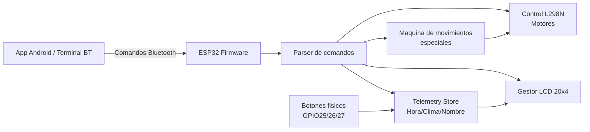
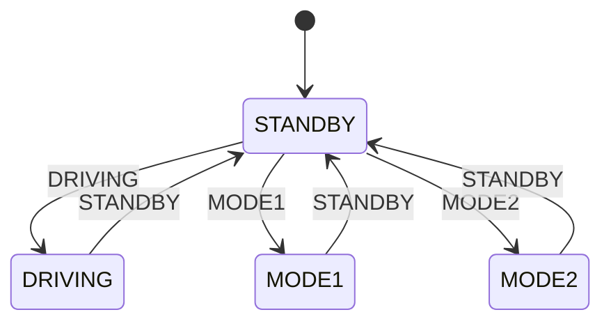

# Car_control_esp32

Control inteligente de un carro con ESP32 + Bluetooth + LCD I2C + movimientos especiales.

[](https://platformio.org/)
[](https://www.arduino.cc/)
[](#-protocolo-bluetooth)
[](#-hardware-y-pines)

---

## Que hace este proyecto

Este firmware convierte un ESP32 en el cerebro de un mini robot con:

- Control de movimiento en tiempo real por Bluetooth (`F`, `B`, `L`, `R`, `S`)
- 4 modos de interfaz en LCD 20x4 (`STANDBY`, `DRIVING`, `MODE1`, `MODE2`)
- Telemetria seleccionable por botones fisicos (hora, clima, nombre)
- 4 movimientos especiales no bloqueantes (`X`, `D`, `V`, `P`)
- Sistema de saludo con reenvio TTS (`TTS:<texto>`) para app Android

---

## Navegacion rapida

- [Demo en 3 minutos](#-demo-en-3-minutos)
- [Arquitectura visual](#-arquitectura-visual)
- [Hardware y pines](#-hardware-y-pines)
- [Protocolo Bluetooth](#-protocolo-bluetooth)
- [Modos LCD](#-modos-lcd)
- [Compilar y cargar](#-compilar-y-cargar-con-platformio)
- [Troubleshooting](#-troubleshooting)

---

## Demo en 3 minutos

1. Conecta el ESP32 por USB.
2. Compila y carga firmware:

```bash
pio run
pio run -t upload
```

3. Abre monitor serie:

```bash
pio device monitor -b 115200
```

4. Conectate por Bluetooth al dispositivo:

```text
Car-ESP32
```

5. Envia comandos rapidos desde tu app o terminal BT:

```text
DRIVING
F
L
S
X
MODE2
SET_HORA:10:45
SET_TIEMPO:Soleado 24C
SET_NOMBRE:Wall-E
```

---

## Arquitectura visual



<details>
<summary><strong>Como fluye internamente un comando</strong></summary>

1. Llega byte por Bluetooth (`SerialBT`).
2. Se arma `inputBuffer` hasta `\n` o timeout (120 ms).
3. `handleCommand(...)` clasifica tipo de comando.
4. Se ejecuta accion (motor, modo, telemetria, LED o movimiento especial).
5. Opcionalmente responde por Bluetooth (`OK:*`, `MOVE:*`, `TTS:*`).

</details>

---

## Hardware y pines

| Componente | Pin ESP32 | Detalle |
|---|---:|---|
| LED ojos | GPIO5 | ON/OFF visual |
| LCD I2C SDA | GPIO21 | Bus I2C |
| LCD I2C SCL | GPIO22 | Bus I2C |
| Boton Hora | GPIO25 | Telemetria hora |
| Boton Clima | GPIO26 | Telemetria clima |
| Boton Nombre | GPIO27 | Telemetria nombre |
| L298N IN1 | GPIO16 | Motor A |
| L298N IN2 | GPIO17 | Motor A |
| L298N IN3 | GPIO18 | Motor B |
| L298N IN4 | GPIO19 | Motor B |

Board configurada en PlatformIO:

```ini
[env:nodemcu-32s]
platform = espressif32
board = nodemcu-32s
framework = arduino
lib_deps =
  duinowitchery/hd44780@^1.3.2
```

---

## Protocolo Bluetooth

Dispositivo Bluetooth:

```text
Car-ESP32
```

### Fast-path (ejecucion inmediata)

| Comando | Accion |
|---|---|
| `F` | Adelante |
| `B` | Atras |
| `L` | Izquierda |
| `R` | Derecha |
| `X` | Explorar |
| `V` | Vigilar |
| `P` | Susto |

### Comandos estandar

| Comando | Accion |
|---|---|
| `S` | Detener |
| `G` | Giro 90 izq aprox |
| `H` | Giro 90 der aprox |
| `D` | Bailar |
| `ON` / `OFF` | LED ojos |
| `CLEAR` | Limpia texto de `MODE1` |

### Modos de pantalla

| Comando | Modo |
|---|---|
| `STANDBY` | Modo inicio |
| `DRIVING` | Modo control |
| `MODE1` | Texto scroll |
| `MODE2` | Telemetria |

### Telemetria

| Comando | Ejemplo |
|---|---|
| `SET_HORA:<valor>` | `SET_HORA:10:45` |
| `SET_TIEMPO:<valor>` | `SET_TIEMPO:Nublado 20C` |
| `SET_NOMBRE:<valor>` | `SET_NOMBRE:Wall-E` |

### Mensajes/saludo

| Comando | Ejemplo |
|---|---|
| `SALUDO:<texto>` | `SALUDO:Hola amigos` |
| `GREETING:<texto>` | `GREETING:Bienvenidos` |
| `TEXT:<texto>` | `TEXT:Proyecto ESP32` |
| `MSG:<texto>` | `MSG:Hola` |

### Respuestas del ESP32

| Respuesta | Significado |
|---|---|
| `OK:ON` | LED encendido |
| `OK:OFF` | LED apagado |
| `MOVE:EXPLORE` | Inicio explorar |
| `MOVE:DANCE` | Inicio bailar |
| `MOVE:SCAN` | Inicio vigilar |
| `MOVE:PRANK` | Inicio susto |
| `MOVE:DONE` | Fin/cancelacion movimiento especial |
| `TTS:<texto>` | Texto listo para sintesis de voz en app |

Mas detalle tecnico en [protocolo.md](protocolo.md).

---

## Modos LCD



<details>
<summary><strong>Que muestra cada modo</strong></summary>

- `STANDBY`: mensaje de espera.
- `DRIVING`: estado de control manual listo.
- `MODE1`: scrolling de saludo/mensaje en las 4 lineas.
- `MODE2`: solicita boton y muestra hora/clima/nombre segun GPIO 25/26/27.

</details>

---

## Movimientos especiales

| Comando | Nombre | Comportamiento |
|---|---|---|
| `X` | Explorar | Ruta aleatoria con segmentos avance+giro |
| `D` | Bailar | Coreografia de 12 pasos |
| `V` | Vigilar | Escaneo 360 con pausas |
| `P` | Susto | Ojos ON + avance rapido + frenazo + dramatica |

Notas:

- Son no bloqueantes (maquina de estados).
- Un comando manual (`F/B/L/R/S/G/H`) cancela el especial actual.
- Al finalizar se emite `MOVE:DONE`.

---

## Compilar y cargar con PlatformIO

### Requisitos

- VS Code + extension PlatformIO IDE
- Driver USB del ESP32

### Comandos

```bash
pio run
pio run -t upload
pio device monitor -b 115200
```

Si tienes multiples puertos:

```bash
pio run -t upload --upload-port COM5
```

---

## Estructura del proyecto

```text
Car/
|- platformio.ini
|- protocolo.md
|- src/
|  |- main.cpp
|- include/
|- lib/
|- test/
```

---

## Troubleshooting

<details>
<summary><strong>No aparece Car-ESP32 por Bluetooth</strong></summary>

- Verifica que el ESP32 este energizado.
- Revisa monitor serie a 115200 y confirma que setup finalizo.
- Reinicia Bluetooth del telefono y vuelve a escanear.

</details>

<details>
<summary><strong>LCD no muestra nada</strong></summary>

- Confirma cableado SDA=21 y SCL=22.
- Revisa direccion I2C del modulo LCD.
- Asegura GND comun entre modulo y ESP32.

</details>

<details>
<summary><strong>Los motores no responden como espero</strong></summary>

- Valida IN1..IN4 en pines 16..19.
- Verifica alimentacion del puente H y motores.
- Prueba comandos directos: `F`, `B`, `L`, `R`, `S`.

</details>

---

## Roadmap sugerido

- [ ] Control de velocidad con PWM
- [ ] Estado de bateria por telemetria
- [ ] Modo autonomo con sensores de distancia
- [ ] OTA update por Wi-Fi

---

## Licencia

Agrega aqui la licencia que prefieras (MIT, Apache-2.0, etc.).
