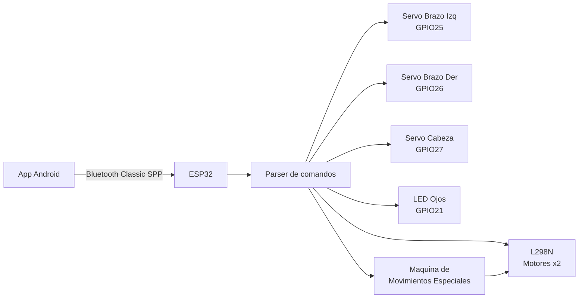

# Car_control_esp32

Control de un carro robot Wall-E con ESP32, Bluetooth Classic, tracción diferencial de 2 ruedas y 3 servomotores.

[](https://platformio.org/)
[](https://www.arduino.cc/)
[](#protocolo-bluetooth)
[](#hardware-y-pines)

---

## Que hace este proyecto

Firmware para un robot móvil de tracción diferencial controlado por Bluetooth desde una app Android:

- Control de movimiento en tiempo real (`F`, `B`, `L`, `R`, `S`)
- 4 movimientos especiales no bloqueantes: Explorar, Bailar, Vigilar, Susto
- Control de 3 servomotores: brazo izquierdo, brazo derecho y cabeza
- Control de LED (ojos del robot)
- Maquina de estados no bloqueante para secuencias de movimiento

---

## Compilar y cargar

```bash
pio run
pio run -t upload
pio device monitor -b 115200
```

---

## Arquitectura visual



---

## Conexiones de hardware

### Alimentacion recomendada

```
Fuente 7.4V (LiPo 2S) o 6xAA (9V)
    │
    ├─→ L298N  VS    (alimenta motores)
    │   L298N  GND ──→ GND comun
    │   L298N  5V  ──→ VCC servos (si el modulo tiene regulador onboard)
    │
    └─→ ESP32  VIN  (o 5V via USB durante desarrollo)
```

> Los servos 9g requieren 5V. No los conectes al pin 3.3V del ESP32 — no entrega corriente suficiente.

---

### ESP32 → L298N (control de motores)

| ESP32 GPIO | L298N pin | Funcion |
|:---:|:---:|---|
| GPIO 16 | IN1 | Motor izquierdo — sentido A |
| GPIO 17 | IN2 | Motor izquierdo — sentido B |
| GPIO 18 | IN3 | Motor derecho — sentido A |
| GPIO 19 | IN4 | Motor derecho — sentido B |
| GND | GND | Tierra comun |

---

### L298N → Motores (traccion diferencial)

```
L298N                        Motores DC
─────────────────────────────────────────────
OUT1 ───────────────────→  Terminal A ┐
OUT2 ───────────────────→  Terminal B ┘  Motor IZQUIERDO

OUT3 ───────────────────→  Terminal A ┐
OUT4 ───────────────────→  Terminal B ┘  Motor DERECHO
```

Logica de movimiento:

| Comando | IN1 | IN2 | IN3 | IN4 | Motor Izq | Motor Der |
|:---:|:---:|:---:|:---:|:---:|:---:|:---:|
| `F` | H | L | H | L | Adelante | Adelante |
| `B` | L | H | L | H | Atras | Atras |
| `L` | H | L | L | H | Adelante | Atras |
| `R` | L | H | H | L | Atras | Adelante |
| `S` | L | L | L | L | Stop | Stop |

---

### ESP32 → Servomotores

| ESP32 GPIO | Servo | Posiciones |
|:---:|---|---|
| GPIO 25 | Brazo izquierdo | Reposo: 0° / Activo: 90° |
| GPIO 26 | Brazo derecho | Reposo: 180° / Activo: 90° |
| GPIO 27 | Cabeza | Izquierda: 45° / Centro: 90° / Derecha: 135° |

Cada servo necesita 3 cables:

```
Servo (señal)  ──→  GPIO correspondiente
Servo (VCC)    ──→  5V externo
Servo (GND)    ──→  GND comun
```

> Los angulos de reposo/activo se ajustan con las constantes al inicio de main.cpp.

---

### ESP32 → LED (ojos del robot)

| ESP32 GPIO | Componente |
|:---:|---|
| GPIO 21 | LED + resistencia (330Ω recomendado) → GND |

---

### Diagrama de pines completo (NodeMCU-32S)

```
                    ┌─────────────┐
              3.3V ─┤             ├─ GND
               EN  ─┤             ├─ GPIO23
             GPIO36 ─┤             ├─ GPIO22
             GPIO39 ─┤   NodeMCU   ├─ GPIO21  ──→ LED (ojos)
             GPIO34 ─┤    32S      ├─ GPIO19  ──→ L298N IN4
             GPIO35 ─┤             ├─ GPIO18  ──→ L298N IN3
             GPIO32 ─┤             ├─ GPIO5
             GPIO33 ─┤             ├─ GPIO17  ──→ L298N IN2
             GPIO25 ─┤             ├─ GPIO16  ──→ L298N IN1
             GPIO26 ─┤             ├─ GPIO4
             GPIO27 ─┤             ├─ GPIO0
             GPIO14 ─┤             ├─ GPIO2
             GPIO12 ─┤             ├─ GPIO15
             GPIO13 ─┤             ├─ GPIO8
              GND  ─┤             ├─ GPIO7
              VIN  ─┤             ├─ GPIO6
                    └─────────────┘

GPIO 25 ──→ Servo brazo izquierdo (señal)
GPIO 26 ──→ Servo brazo derecho   (señal)
GPIO 27 ──→ Servo cabeza          (señal)
```

---

## Protocolo Bluetooth

Dispositivo: **`Car-ESP32`**
Tipo: Bluetooth Classic SPP
Formato: texto plano + `\n` por comando

### Movimiento

| Comando | Accion |
|:---:|---|
| `F` | Adelante (ambos motores) |
| `B` | Atras (ambos motores) |
| `L` | Giro izquierda sobre el eje |
| `R` | Giro derecha sobre el eje |
| `S` | Stop |
| `G` | Giro izquierda ~90° y stop |
| `H` | Giro derecha ~90° y stop |

### Movimientos especiales

| Comando | Nombre | Descripcion |
|:---:|---|---|
| `X` | Explorar | Ruta aleatoria con avances y giros |
| `D` | Bailar | Coreografia de 12 pasos |
| `V` | Vigilar | Escaneo 360° con pausas |
| `P` | Susto | Ojos ON + avance rapido + frenazo dramatico |

> Cualquier comando de movimiento manual (`F/B/L/R/S/G/H`) cancela el movimiento especial activo.

### Servos

| Comando | Accion |
|:---:|---|
| `BRAZOS` | Toggle brazos: reposo ↔ activo (90°) |
| `CABEZA_IZQ` | Cabeza a 45° (izquierda) |
| `CABEZA_CEN` | Cabeza a 90° (centro) |
| `CABEZA_DER` | Cabeza a 135° (derecha) |

### LED (ojos)

| Comando | Accion |
|:---:|---|
| `ON` | Enciende LED |
| `OFF` | Apaga LED |

### Respuestas del ESP32 hacia la app

| Respuesta | Significado |
|---|---|
| `OK:ON` | LED encendido confirmado |
| `OK:OFF` | LED apagado confirmado |
| `MOVE:DANCE` | Inicio secuencia bailar |
| `MOVE:SCAN` | Inicio secuencia vigilar |
| `MOVE:PRANK` | Inicio secuencia susto |
| `MOVE:EXPLORE` | Inicio secuencia explorar |
| `MOVE:DONE` | Secuencia especial finalizada o cancelada |

---

## Librerias utilizadas

```ini
lib_deps =
  duinowitchery/hd44780@^1.3.2       ; reservado para LCD (actualmente deshabilitado)
  madhephaestus/ESP32Servo@^0.13.0   ; control de servomotores
```

---

## Estructura del proyecto

```text
Car/
├── platformio.ini
├── README.md
├── protocolo.md
└── src/
    └── main.cpp
```

---

## Troubleshooting

<details>
<summary><strong>El motor arranca solo al encender</strong></summary>

Asegurate de flashear la version mas reciente del firmware. El fix de inicialización fuerza LOW en todos los pines del L298N antes de activar el driver (`digitalWrite` antes de `pinMode`), eliminando el transitorio de boot.

</details>

<details>
<summary><strong>No aparece Car-ESP32 por Bluetooth</strong></summary>

- Verifica que el ESP32 este energizado.
- Abre el monitor serie a 115200 baud y confirma que el setup finalizó correctamente.
- Reinicia Bluetooth del teléfono y vuelve a escanear.

</details>

<details>
<summary><strong>Los servos no responden o mueven los motores</strong></summary>

- Confirma que las señales de servo esten en GPIO 25, 26 y 27.
- No uses GPIO 12, 13 o 14 para servos — son pines de strapping del ESP32 e interfieren con el LEDC.
- Verifica que los servos tengan 5V externos, no el pin 3.3V del ESP32.
- Confirma GND comun entre ESP32, L298N y servos.

</details>

<details>
<summary><strong>El comando BRAZOS activa un motor en lugar del servo</strong></summary>

Esto ocurre si los servos estan en GPIO 12 o 14. Mueve los cables a GPIO 25 y 26 y reflashea.

</details>

<details>
<summary><strong>Los motores no responden como espero</strong></summary>

- Valida IN1=GPIO16, IN2=GPIO17, IN3=GPIO18, IN4=GPIO19.
- Verifica alimentacion del L298N (minimo 6V para motores con traccion suficiente).
- Confirma que ENA y ENB del L298N esten en HIGH (jumper o señal).
- Prueba comandos directos desde un terminal BT: `F`, `B`, `L`, `R`, `S`.

</details>

---

## Roadmap

- [ ] Control de velocidad con PWM (ENA/ENB del L298N)
- [ ] Estado de bateria por telemetria
- [ ] Modo autonomo con sensor de distancia ultrasónico
- [ ] OTA update por Wi-Fi
- [ ] Reactivar LCD I2C 20x4 y botones fisicos

---

## Licencia

Agrega aqui la licencia que prefieras (MIT, Apache-2.0, etc.).
